`contact@securi-tee.com` · `Winnipeg, CA`

---

- **Bug Bounty Hunting** — active offensive research across public & private programs
- **eJPT** — offensive security certification _(in progress)_ · red-team projects incoming

- **SOC Detection Lab** — end-to-end SIEM detecting simulated adversaries, mapped to ATT&CK  
  `ELK` · `Atomic Red Team` · `Tines SOAR` · `MITRE ATT&CK`
- **Application Security Audit** — manual review + automated SAST/DAST, catching vulns pre-release  
  `Semgrep` · `OWASP ZAP`

- **Cyberfeed V2** — automated OSINT collection aggregating 37+ threat-intel feeds  
  `Flask` · `PostgreSQL` · `OSINT`
- **securi-tee.com** — this profile's big brother; my portfolio, hardened  
  `Next.js` · `TinaCMS` · `CSP-hardened`

---

**certs**&nbsp;&nbsp; `Security+` · `TryHackMe SOC L1` · `AWS Cloud Essentials` · `Kubernetes` · `eJPT (in progress)`

<i>si vis pacem, para bellum</i>
